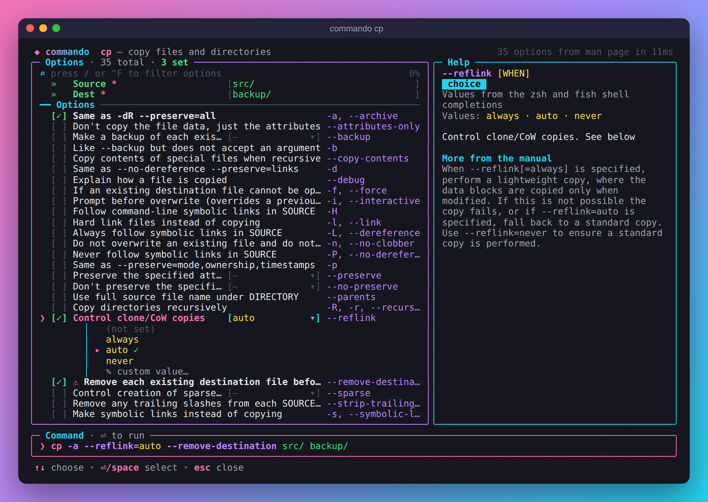

# commando

A colorful terminal UI that sits in front of any Unix command and turns its
manual page into a form. Pick options with checkboxes, dropdowns and radio
buttons, read what each option does as you go, then press **Enter** to run
the command you built.

```sh
commando ls
```



## Features

- **Reads the real documentation.** Options come from the command's `man`
  page (BSD/macOS `mandoc` and GNU `groff` layouts), or from `--help` output
  for tools that ship without one (cargo, rustc, many Go/Node CLIs).
- **The right control for each option:**
  - flags → checkboxes (repeatable flags such as `-v` count up with ←/→)
  - enumerated values → dropdowns (`--color` → always / auto / never), with
    a "custom value…" entry in case the manual is incomplete
  - mutually exclusive flags → radio buttons (“The -1, -C, -x, and -l
    options all override each other” becomes a *Format* group)
  - numbers → digit-only fields with `+`/`-` stepping
  - files and directories → path fields with Tab completion
- **Readable labels.** Each option gets a label taken from the first sentence
  of its description, alongside its flag names and grouped under the manual's
  own subsections (e.g. grep's *Matching Control*, tar's *Operation mode*).
- **Help as you go.** The side panel explains the focused option in full;
  `^O` opens the whole manual, scrolled to that option, with `/` search.
- **Conflicts handled.** When the manual says an option is mutually exclusive
  with another (“This option cancels the -P option”), turning one on turns
  the other off.
- **Pre-fills from what you typed.** `commando grep -rn TODO .` opens with
  `-r` and `-n` already checked and `TODO .` as arguments.
- **Presets and recent commands.** Every command you run is remembered, and
  `Ctrl-T` saves the current form as a named preset. The next time you open
  `commando tar`, your presets and recent tar commands are listed first: pick
  one and adjust it instead of starting over.
- **Subcommands.** `commando git commit` uses `git-commit(1)`;
  `commando cargo build` uses `cargo build --help`.
- **Fast.** The form opens immediately and loads in the background. Parsed
  manuals are cached (keyed by the page's path, size and mtime), so a second
  run of even `curl`'s 5,000-line manual takes ~20 ms.
- **Looks good in iTerm2 and Terminal.app:** truecolor gradients where
  supported, adaptive colors for light and dark profiles, mouse support.

## Install

With Homebrew (macOS or Linux; installs a prebuilt binary, no Go needed):

```sh
brew tap lonedevel/commando https://github.com/lonedevel/commando
brew install commando
```

Or with Go 1.24+:

```sh
go install github.com/lonedevel/commando/cmd/commando@latest
```

Or download a prebuilt archive for macOS or Linux from the
[releases page](https://github.com/lonedevel/commando/releases), unpack it and
put `commando` on your `PATH`. The binaries aren't signed, so if macOS says it
can't verify the developer, run `xattr -d com.apple.quarantine commando` once.

or from a checkout:

```sh
make install        # go install ./cmd/commando
```

## Usage

```sh
commando                 # asks which command, with completion from $PATH
commando ls              # build an ls command and run it
commando grep -rn TODO   # start from an existing command line
commando -p tar          # print the command instead of running it
commando --long rsync    # prefer --long option names
```

When you press Enter, commando prints the final command and runs it with
your `$SHELL`. With `-p/--print` it writes the command to stdout instead, so
you can capture it: `cmd=$(commando -p find)`.

### Shell integration (recommended)

Bind commando to a key so it edits the command you're typing. The result
lands back on your prompt for review, and goes into your shell history when
you run it.

```sh
# zsh (~/.zshrc)
eval "$(commando --init zsh)"
# bash (~/.bashrc)
eval "$(commando --init bash)"
# fish (~/.config/fish/config.fish)
commando --init fish | source
```

Then type a command, for example `rsync -a`, and press **Ctrl-X Ctrl-O**.

### Presets and recent commands

commando remembers the last 10 command lines you ran for each command, and
any presets you save:

- **Save a preset:** fill in the form, press `Ctrl-T` and type a name, such
  as "gzip archive of a folder".
- **Reuse one:** when you open a command with no options typed, its presets
  and recent commands are listed first. Choose one and press Enter to load
  it into the form, then adjust it and run. `Ctrl-L` brings the list back at
  any time, and `d` deletes the highlighted entry.
- **Start from anywhere:** running `commando` with no command lists your most
  recent commands across all tools.

They are stored in `~/Library/Application Support/commando/store.json` on
macOS and `~/.config/commando/store.json` on Linux (set `COMMANDO_DATA_DIR`
to change the folder). The file is readable only by you, but like your
shell history it holds the full command lines, including any tokens or
passwords you typed. Pass `--no-history`, or set `COMMANDO_NO_HISTORY=1`, to
turn this off.

### Keys

| Key | Action |
| --- | --- |
| `↑` `↓` / `Tab` `Shift-Tab` / `PgUp` `PgDn` | Move between fields |
| `Space` | Toggle a checkbox, pick a radio button, open a dropdown |
| `←` `→` | Cycle dropdown values; turn flags on/off; change repeat count |
| typing | Edit text, number and path fields (`+`/`-` steps numbers) |
| `Tab` (in a path field or Arguments) | Complete file names |
| `/` or `Ctrl-F` | Filter options by name, label or description |
| `Ctrl-O` / `F1` / `?` | Open the full manual at the focused option |
| `Shift-↑` `Shift-↓` | Scroll the help panel |
| `Ctrl-S` | Switch between short (`-a`) and long (`--all`) names |
| `Ctrl-L` | Show presets and recent commands |
| `Ctrl-T` | Save the form as a named preset |
| `Ctrl-Y` | Copy the command to the clipboard |
| `Ctrl-R` | Clear everything |
| `Enter` | Run the command (or print it with `-p`) |
| `Esc` | Close dropdown / clear filter / quit |

In the manual viewer: `↑↓`/`jk` scroll, `Space`/`b` page, `g`/`G` top and
bottom, `/` search, `n`/`N` next and previous match, `Esc` back.

## How it works

1. `man -w <cmd>` finds the page; `man <cmd>` renders it at a fixed width
   with the pager disabled. Backspace overstriking and ANSI escapes are
   stripped.
2. The parser finds option tags (`-a, --all`, `--color[=WHEN]`, `-D format`,
   `-d, --data <data>`) by their indentation relative to their descriptions,
   learns each page's layout, and ignores body text that merely begins with a
   dash.
3. Values are inferred from the descriptions: “*WHEN* is never, always, or
   auto”, “If *TYPE* is without-match…”, “sort by WORD instead of name: none
   (-U), size (-S)…”, `{a,b,c}` and clap's `[possible values: …]`. Sample
   values (“e.g. 200K, 3m”) are not mistaken for choices.
4. The result is cached as JSON in `~/Library/Caches/commando` (macOS) or
   `$XDG_CACHE_HOME/commando`. Set `COMMANDO_CACHE_DIR` to change it, or pass
   `--no-cache`.

`commando --dump <cmd>` prints the parsed structure, which is handy when a
manual page is parsed in a surprising way.

## Development

```sh
make test     # unit tests, including fixtures from GNU, BSD and macOS man pages
make build    # ./bin/commando
make dist     # release archives for macOS and Linux in ./dist
```

### Releasing

Releases are published by the `Release` workflow whenever `main` declares a
version that isn't tagged yet:

1. Set `version` in `cmd/commando/main.go` (e.g. `0.3.0`).
2. Add a `## v0.3.0` section at the top of `RELEASE_NOTES.md`.
3. Merge to `main`. The workflow runs the tests, builds the archives, tags
   `v0.3.0` and publishes the release with those notes and files.
4. Run `scripts/update-formula.sh 0.3.0` and merge the change. It rewrites
   `Formula/commando.rb` to install that release's prebuilt binaries, using
   the checksums the release published.

## License

Apache 2.0 — see [LICENSE](LICENSE).
