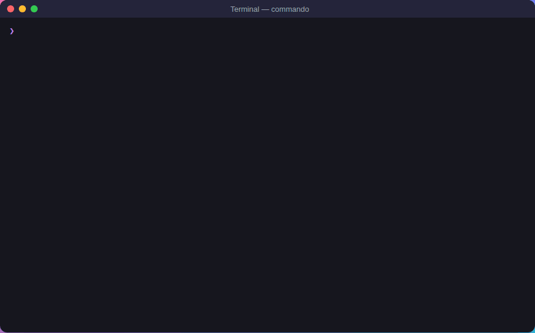
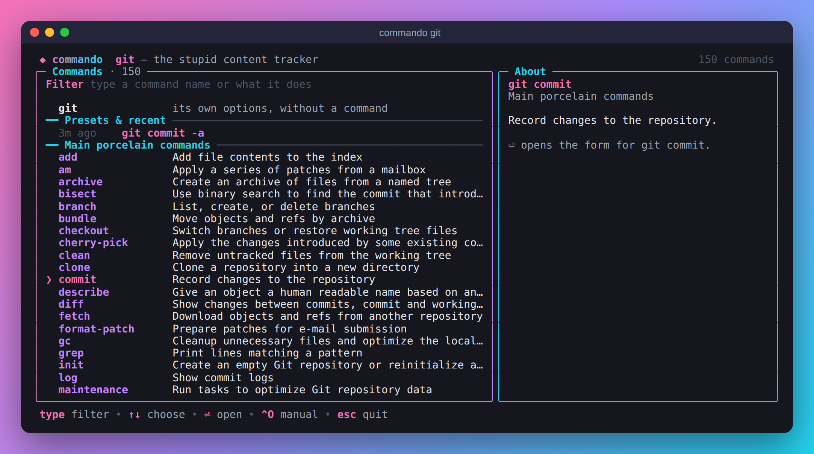
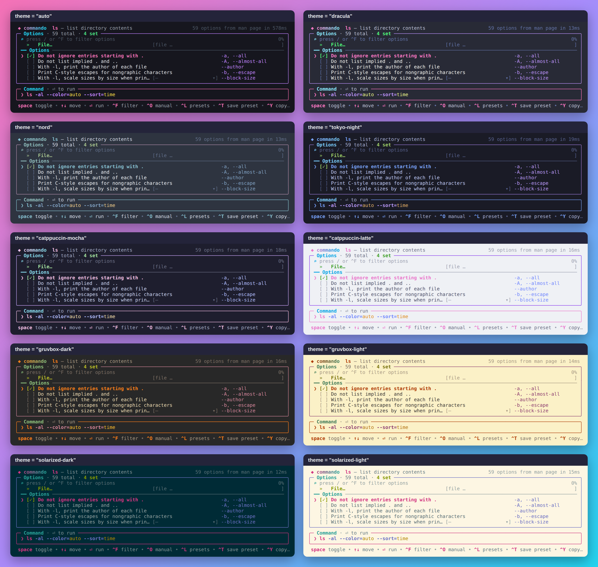

# commando

A colorful terminal UI that sits in front of any Unix command and turns its
manual page into a form. Pick options with checkboxes, dropdowns and radio
buttons, read what each option does as you go, then press **Enter** to run
the command you built.



*In the recording: `commando git` lists git's commands; `log` opens the
`git log` form and `^X` loads an example from its manual; `--explain` breaks
down a `find` command and flags the risky `-delete`; and typing `photos` on
the start screen finds past commands.*

## At a glance

- **A form for any command** with a man page or `--help`: checkboxes,
  dropdowns, radio buttons, number and path fields, and an argument field
  for each of its arguments. Run it with Enter, or put it on your prompt.
- **Help as you go:** each option explained, values described, the full
  manual one key away, and the manual's own examples ready to load (`^X`).
- **Subcommands:** `commando git`, `docker`, `cargo` or `go` lists their
  commands first, nested ones too (`docker` → `container` → `ls`).
- **Explain mode:** `commando --explain 'LINE'`, or `Ctrl-X ?` in your shell,
  says what each part of a command line does, pipelines included.
- **Safety:** options that delete or overwrite data are marked ⚠ and asked
  about before running; `find` expressions keep a safe order.
- **Remembers:** recent commands and named presets for each command, and
  the start screen searches all of them.
- **Yours to adjust:** a settings file for defaults and corrections, and 13
  color themes (`commando --themes` previews them).
- **Fast:** manuals are parsed once and cached; reopening even curl's takes
  about 20 ms.

## Features in detail

### Forms from manuals

- **Reads the real documentation.** Options come from the command's `man`
  page (BSD/macOS `mandoc` and GNU `groff` layouts), or from `--help` output
  for tools that ship without one (cargo, rustc, many Go/Node CLIs).
- **The right control for each option:**
  - flags → checkboxes (repeatable flags such as `-v` count up with ←/→)
  - enumerated values → dropdowns (`--color` → always / auto / never),
    taken from the manual and from zsh and fish completion definitions,
    with a "custom value…" entry in case a list is incomplete. Where the
    manual says what each value means (`find -type`: `d` directory, `f`
    regular file…; `tar --format`; `git log --date`), the dropdown and the
    help panel show it
  - mutually exclusive flags → radio buttons (“The -1, -C, -x, and -l
    options all override each other” becomes a *Format* group)
  - numbers → digit-only fields with `+`/`-` stepping
  - files and directories → path fields with Tab completion
  - positional arguments → a labelled field each, read from the usage line
    (`cp SOURCE DEST` gets Source and Dest; `grep PATTERNS [FILE...]` gets
    Patterns and File…). Required ones are marked `*`, and Enter warns once
    if one is empty. When a usage line is too irregular to read (tar, curl),
    there's a single Arguments field instead
- **Readable labels.** Each option gets a label taken from the first sentence
  of its description, alongside its flag names and grouped under the manual's
  own subsections (e.g. grep's *Matching Control*, tar's *Operation mode*).
- **Conflicts handled.** When the manual says an option is mutually exclusive
  with another (“This option cancels the -P option”), turning one on turns
  the other off.
- **Pre-fills from what you typed.** `commando grep -rn TODO .` opens with
  `-r` and `-n` already checked and `TODO .` as arguments.


### Help, examples and explanations

- **Help as you go.** The side panel explains the focused option in full;
  `^O` opens the whole manual, scrolled to that option, with `/` search.
- **Examples from the manual.** `^X` lists the ready-made command lines
  from the manual's EXAMPLES section, each with its explanation: `git log`,
  `find`, `rsync`, `grep` and many more have them. Manuals that give an
  example under each option, as curl's does, show it in the help panel, and
  `^X` on that option jumps to it. Press Enter to load one into the form and
  adjust it. Examples the form can't hold exactly, such as
  ones using `!` or parentheses, are marked ⧉, and Enter copies them instead.
- **Explain a command line.** `commando --explain 'tar -czvf backup.tgz src'`
  prints what each option and argument means, from the manual, without
  opening the form. It handles pipelines, `sudo`/`xargs`-style wrappers,
  redirections and `find`'s `!` and parentheses, and marks risky options
  with ⚠. The shell shortcut `Ctrl-X ?` explains the line you're typing, and
  the preview beside presets, recent commands and examples explains each one.

### Subcommands

- **Subcommands.** `commando git` lists git's commands with a line on what
  each does, grouped the way git's manual groups them (main porcelain,
  ancillary, plumbing…). Type to filter, then press Enter to open that
  command's form. Your presets and recent git commands are listed first.
  Tools documented by `--help`, such as cargo, docker and kubectl, list the
  commands from their "Commands:" sections. Commands that group others open
  a second list: `docker` → `container` → `ls`. `commando git commit` skips the
  list and uses `git-commit(1)`; `commando cargo build` uses
  `cargo build --help`.

### Safety

- **Warnings for risky options.** Options that delete or overwrite data, or
  that skip a confirmation prompt (`rm -r`, `rm -f`, `rsync --delete`,
  `find -delete`, `tar --remove-files`, `git push --force`…), are marked with
  a red ⚠ and the help panel says why. If the command you built uses one,
  Enter asks you to confirm before running it.
- **Expressions kept in order.** For `find`, the form puts the paths first,
  then the tests in the order you turn them on, then actions such as
  `-print`, `-exec` and `-delete`, so `find . -name '*.tmp' -delete` never
  becomes `find . -delete -name '*.tmp'`. If a command line you start from
  can't be kept exactly as typed, commando says so before you run it.

### Reuse

- **Presets and recent commands.** Every command you run is remembered, and
  `Ctrl-T` saves the current form as a named preset. The next time you open
  `commando tar`, your presets and recent tar commands are listed first: pick
  one and adjust it instead of starting over.

### Speed and looks

- **Fast.** The form opens immediately and loads in the background. Parsed
  manuals are cached (keyed by the page's path, size and mtime), so a second
  run of even `curl`'s 5,000-line manual takes ~20 ms.
- **Looks good in iTerm2 and Terminal.app:** truecolor gradients where
  supported, adaptive colors for light and dark profiles, mouse support.

## Install

With Homebrew (macOS or Linux; installs a prebuilt binary, no Go needed):

```sh
brew tap lonedevel/commando https://github.com/lonedevel/commando
brew install commando
```

To upgrade, refresh the tap first (Homebrew only updates it during
`brew update`, which `brew upgrade` skips if it ran recently):

```sh
brew update && brew upgrade commando
```

Or with Go 1.24+:

```sh
go install github.com/lonedevel/commando/cmd/commando@latest
```

Or download a prebuilt archive for macOS or Linux from the
[releases page](https://github.com/lonedevel/commando/releases), unpack it and
put `commando` on your `PATH`. The binaries aren't signed, so if macOS says it
can't verify the developer, run `xattr -d com.apple.quarantine commando` once.

or from a checkout:

```sh
make install        # go install ./cmd/commando
```

## Usage

```sh
commando                 # asks which command, with completion from $PATH
commando ls              # build an ls command and run it
commando git             # pick a git command, then its options
commando grep -rn TODO   # start from an existing command line
commando -p tar          # print the command instead of running it
commando --long rsync    # prefer --long option names
commando --explain 'rsync -av --delete src/ host:/backup'
```

When you press Enter, commando prints the final command and runs it with
your `$SHELL`. With `-p/--print` it writes the command to stdout instead, so
you can capture it: `cmd=$(commando -p find)`.

If the command uses an option marked ⚠ (it can delete or overwrite data),
Enter first asks "Run it?": press `y` to run, any other key to go back to
the form. `-p` and the shell shortcut don't ask, since they only put the
command on your prompt. Set `COMMANDO_NO_CONFIRM=1` to never ask.

### Shell integration (recommended)

Bind commando to a key so it edits the command you're typing. The result
lands back on your prompt for review, and goes into your shell history when
you run it.

```sh
# zsh (~/.zshrc)
eval "$(commando --init zsh)"
# bash (~/.bashrc)
eval "$(commando --init bash)"
# fish (~/.config/fish/config.fish)
commando --init fish | source
```

Then type a command, for example `rsync -a`, and press **Ctrl-X Ctrl-O**.
Press **Ctrl-X ?** instead to explain the line below your prompt without
changing it. (The bash shortcuts need bash 4 or later; macOS ships 3.2, so
use Homebrew's bash or zsh.)

### Choosing a subcommand

Opening a tool that has subcommands without naming one, as in
`commando git` or `commando docker`, lists its commands first:



The first entry opens the form for the tool's own options. A command that
groups others, such as `docker container` or `kubectl config`, opens its own
list (the title reads `docker › container`), and `commando docker container`
starts there. Esc in a command's form returns to its list, and Esc in a
list goes back up a level.

### Presets and recent commands

commando remembers the last 10 command lines you ran for each command, and
any presets you save:

- **Save a preset:** fill in the form, press `Ctrl-T` and type a name, such
  as "gzip archive of a folder".
- **Reuse one:** when you open a command with no options typed, its presets
  and recent commands are listed first. Choose one and press Enter to load
  it into the form, then adjust it and run. `Ctrl-L` brings the list back at
  any time. Type to filter the list (`retry` finds curl's retry examples
  among hundreds); Delete or `^D` deletes the highlighted entry.
- **Start from anywhere:** running `commando` with no command lists your most
  recent commands across all tools. Type words to search everything you've
  run and saved, such as `photos` or `rsync backup`, and press Enter to open
  that line's form. Command names still complete as you type.

They are stored in `~/Library/Application Support/commando/store.json` on
macOS and `~/.config/commando/store.json` on Linux (set `COMMANDO_DATA_DIR`
to change the folder). The file is readable only by you, but like your
shell history it holds the full command lines, including any tokens or
passwords you typed. Pass `--no-history`, or set `COMMANDO_NO_HISTORY=1`, to
turn this off.

### Settings

`commando --config` shows where the settings file is, writes a commented
one if you don't have one yet, and checks it for mistakes. It's
`~/.config/commando/config.toml` (or `$XDG_CONFIG_HOME/commando`; set
`COMMANDO_CONFIG` to use another file). Flags and environment variables
win over it.

```toml
long = true             # prefer --long option names
confirm = true          # ask before running a command that uses a ⚠ option
history = true          # remember commands; offer presets and recent ones
recent = 20             # recent commands kept per command
theme = "contrast"      # auto, dark, light, contrast, or a named scheme

[colors]                # by role: accent, command, header, option, value,
danger = "#FF5555"      # argument, path, group, danger, text, dim, faint

# Corrections for a command, by its full name.
[commands."docker run"]
safe = ["--rm"]                 # never mark these ⚠
risky = ["--privileged"]        # always mark these ⚠

[commands.ls.values]            # extra values for a dropdown
"--quoting-style" = ["clocale"]
```

#### Themes

`auto` (the default) follows your terminal's background; `dark` and
`light` fix it; `contrast` uses stronger colors. The named themes match
terminals set to the same color scheme: `dracula`, `nord`, `tokyo-night`,
`catppuccin-mocha`, `catppuccin-latte`, `gruvbox-dark`, `gruvbox-light`,
`solarized-dark` and `solarized-light`. `[colors]` still adjusts any role
on top of a theme. `commando --themes` prints a sample form in each theme in
your own terminal, so you can see which suits it (`commando --themes nord
dracula` shows just those).



### Keys

| Key | Action |
| --- | --- |
| `↑` `↓` / `Tab` `Shift-Tab` / `PgUp` `PgDn` | Move between fields |
| `Space` | Toggle a checkbox, pick a radio button, open a dropdown |
| `←` `→` | Cycle dropdown values; turn flags on/off; change repeat count |
| typing | Edit text, number and path fields (`+`/`-` steps numbers) |
| `Tab` (in a path field or Arguments) | Complete file names |
| `/` or `Ctrl-F` | Filter options by name, label or description |
| `Ctrl-O` / `F1` / `?` | Open the full manual at the focused option |
| `Shift-↑` `Shift-↓` | Scroll the help panel |
| `Ctrl-S` | Switch between short (`-a`) and long (`--all`) names |
| `Ctrl-X` | Show examples from the manual |
| `Ctrl-L` | Show presets, recent commands and examples |
| `Ctrl-T` | Save the form as a named preset |
| `Ctrl-Y` | Copy the command to the clipboard |
| `Ctrl-R` | Clear everything |
| `Enter` | Run the command (or print it with `-p`) |
| `Esc` | Close dropdown / clear filter / back to the command list / quit |

In the command list: type to filter, `↑↓` choose, `Enter` open, `^O` the
tool's manual, `Esc` clear the filter, go up a level, or quit.

In the manual viewer: `↑↓`/`jk` scroll, `Space`/`b` page, `g`/`G` top and
bottom, `/` search, `n`/`N` next and previous match, `Esc` back.

## How it works

1. `man -w <cmd>` finds the page; `man <cmd>` renders it at a fixed width
   with the pager disabled. Backspace overstriking and ANSI escapes are
   stripped.
2. The parser finds option tags (`-a, --all`, `--color[=WHEN]`, `-D format`,
   `-d, --data <data>`) by their indentation relative to their descriptions,
   learns each page's layout, and ignores body text that merely begins with a
   dash.
3. Values are inferred from the descriptions: “*WHEN* is never, always, or
   auto”, “If *TYPE* is without-match…”, “sort by WORD instead of name: none
   (-U), size (-S)…”, `{a,b,c}` and clap's `[possible values: …]`. Sample
   values (“e.g. 200K, 3m”) are not mistaken for choices.
4. The shells' own completion definitions add more value lists. zsh's
   (which macOS always ships) and fish's, if installed, often spell out the
   exact values an option takes: `tar --format` gets gnu, pax, ustar and so
   on, and `grep --binary-files` gets binary, without-match and text. With
   fish installed, `curl -X` also gets the HTTP methods. The help panel says
   when values came from there. Set `COMMANDO_NO_COMPLETIONS=1` to
   turn this off, or point `COMMANDO_ZSH_COMPLETIONS` /
   `COMMANDO_FISH_COMPLETIONS` (colon-separated folders) at extra
   definitions.
5. The parsed manual is cached as JSON in `~/Library/Caches/commando` (macOS) or
   `$XDG_CACHE_HOME/commando`. Set `COMMANDO_CACHE_DIR` to change it, or pass
   `--no-cache`.

`commando --dump <cmd>` prints the parsed structure, which is handy when a
manual page is parsed in a surprising way.

## Development

```sh
make test     # unit tests, including fixtures from GNU, BSD and macOS man pages
make build    # ./bin/commando
make dist     # release archives for macOS and Linux in ./dist
```

### Releasing

Releases are published by the `Release` workflow whenever `main` declares a
version that isn't tagged yet:

1. Set `version` in `cmd/commando/main.go` (e.g. `0.3.0`).
2. Add a `## v0.3.0` section at the top of `RELEASE_NOTES.md`.
3. Merge to `main`. The workflow runs the tests, builds the archives, tags
   `v0.3.0` and publishes the release with those notes and files.
4. The workflow then opens a pull request, `formula-v0.3.0`, that points
   `Formula/commando.rb` at that release's prebuilt binaries with the
   checksums it published, and starts CI on it. Merge it once the homebrew
   checks pass. (`scripts/update-formula.sh 0.3.0` does the same by hand.)

## License

Apache 2.0 — see [LICENSE](LICENSE).
